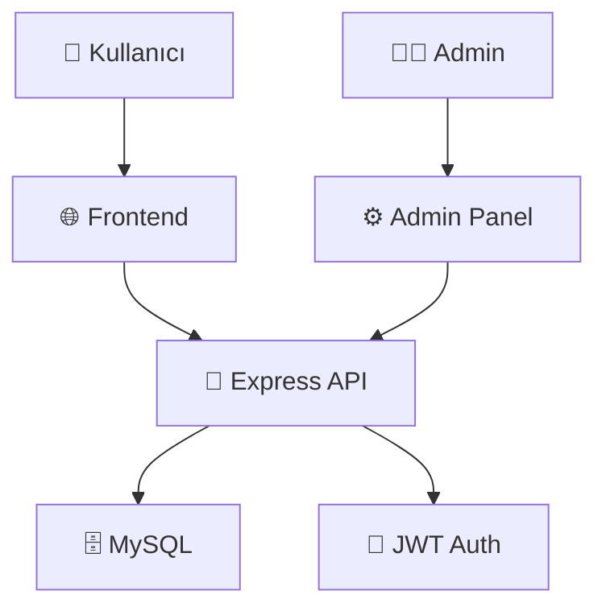

<div align="center">

# � SSS Sistemi 
### *Sıkça Sorulan Sorular için Akıllı Platform*

[](https://nodejs.org/)
[](https://expressjs.com/)
[](https://mysql.com/)
[](https://developer.mozilla.org/en-US/docs/Web/JavaScript)

*Eğitim kurumları ve organizasyonlar için geliştirilmiş, modern ve kullanıcı dostu SSS yönetim sistemi*

[🚀 Hızlı Başlangıç](#-hızlı-başlangıç) • [📖 Dokümantasyon](#-kullanım) • [🎯 Özellikler](#-özellikler) • [🤝 Katkıda Bulun](#-katkıda-bulunma)

</div>

---

## 🎯 Ne Yapıyor Bu Sistem?

**SSS Sistemi**, kullanıcılarınızın en çok merak ettiği soruları organize bir şekilde sunmanızı sağlar. Öğrenciler soru sorar, yöneticiler cevaplar ve herkes faydalanır! 

```
👤 Kullanıcı Soruyor  →  🔍 Admin İnceliyor  →  ✅ Cevap Yayınlanıyor  →  🌟 Herkes Faydalanıyor
```

## ✨ Neden Bu Sistem?

<table>
<tr>
<td width="50%">

### 🎓 **Eğitim Kurumları İçin**
- Öğrenci sorularını merkezi yönetim
- Akademik süreçlerin şeffaflaştırılması  
- Kayıt dönemlerinde yoğunluk azaltma
- 7/24 erişilebilir bilgi bankası

</td>
<td width="50%">

### 🏢 **Organizasyonlar İçin**
- Müşteri destek yükünü azaltma
- Sık sorulan soruları otomatize etme
- Personel verimliliğini artırma
- Kaliteli hizmet standardı oluşturma

</td>
</tr>
</table>

## 🚀 Özellik Galerisi

### 👥 Kullanıcı Deneyimi
```
🔐 Güvenli Kayıt/Giriş    📱 Mobil Uyumlu Tasarım    🔍 Akıllı Arama Motoru
     ↓                          ↓                           ↓
🏷️ Kategori Filtreleme    ⚡ Anlık Sonuçlar        ❓ Kolay Soru Gönderimi
```

### �️ Admin Süper Güçleri
```
📊 Kapsamlı Dashboard     ⚖️ Soru Moderasyonu      👥 Kullanıcı Yönetimi
     ↓                          ↓                           ↓
📝 İçerik Editörü        🎯 Kategori Organizeri    📈 Sistem Analitikleri
```

## 🏗️ Teknoloji Mimarisi

<div align="center">



</div>

### 🎯 **Tech Stack Detayları**

<table>
<tr>
<td align="center" width="20%">

<br><strong>Runtime</strong><br>
<em>Hızlı & Güvenilir</em>
</td>
<td align="center" width="20%">

<br><strong>Web Framework</strong><br>
<em>Minimal & Esnek</em>
</td>
<td align="center" width="20%">

<br><strong>Database</strong><br>
<em>Güçlü & Ölçeklenebilir</em>
</td>
<td align="center" width="20%">

<br><strong>Authentication</strong><br>
<em>Güvenli & Modern</em>
</td>
<td align="center" width="20%">

<br><strong>Frontend</strong><br>
<em>Vanilla & Performant</em>
</td>
</tr>
</table>

## � Proje Anatomisi

```
🏗️ SSS-System/
├── 👨‍💼 admin/                    # Admin krallığı
│   ├── 🚪 admin-login/           # Güvenli giriş kapısı
│   └── 🎛️ panel/                # Kontrol merkezi
├── ⚙️ backend/                   # Beyin merkezi  
│   ├── 🛡️ middleware/            # Güvenlik kalkanı
│   ├── 🔗 db.js                 # Veri bağlantı köprüsü
│   ├── 🚀 server.js             # Ana güç kaynağı
│   └── 📦 package.json          # Bağımlılık haritası
├── 🗄️ database/                 # Bilgi hazinesi
│   └── 📋 schema.sql            # Yapı planı
└── 👥 frontend/                 # Kullanıcı sarayı
    ├── 🔐 login/                # Giriş salonu  
    ├── ✍️ register/             # Kayıt bürosu
    └── 🏠 sayfa/                # Ana yaşam alanı
```

> 💡 **Pro Tip:** Her klasör özel bir görevi olan mini bir modül gibi düşünün!

## 🚀 Hızlı Başlangıç

> ⚡ **Hızlı Not:** Bu kurulum sadece 5 dakika sürer!

### 🔧 Sistem Gereksinimleri
```bash
✅ Node.js v14+        # JavaScript motoru
✅ MySQL Server        # Veri deposu  
✅ npm/yarn            # Paket yöneticisi
✅ Git                 # Versiyon kontrolü
```

### 🎯 **Express Kurulum**

<details>
<summary>📥 <strong>1. Projeyi İndirin</strong></summary>

```bash
# Repository'yi klonlayın
git clone <repository-url>
cd SSS-System

# Tebrikler! İlk adım tamamlandı 🎉
```
</details>

<details>
<summary>📦 <strong>2. Bağımlılıkları Yükleyin</strong></summary>

```bash
# Backend klasörüne gidin
cd backend

# Gerekli paketleri yükleyin
npm install

# Paketler yükleniyor... ☕ Kahve molası zamanı!
```
</details>

<details>
<summary>🗄️ <strong>3. Veritabanını Hazırlayın</strong></summary>

```bash
# MySQL'e bağlanın
mysql -u root -p

# Veritabanını oluşturun
CREATE DATABASE sss_sistemi;

# Tabloları oluşturun
mysql -u root -p sss_sistemi < database/schema.sql

# Veritabanı hazır! 🎯
```
</details>

<details>
<summary>⚙️ <strong>4. Yapılandırma</strong></summary>

`backend/db.js` dosyasını düzenleyin:
```javascript
const pool = mysql.createPool({
    host: 'localhost',           // 🏠 Ev adresi
    user: 'kullanici_adiniz',    // 👤 Kullanıcı adınız
    password: 'super_gizli_sifre', // 🔐 Gizli şifreniz
    database: 'sss_sistemi',     // 🗄️ Veritabanı adı
    port: 3306                   // 🚪 Kapı numarası
});
```
</details>

<details>
<summary>🚀 <strong>5. Sistemi Başlatın</strong></summary>

```bash
# Sunucuyu çalıştırın
cd backend
node server.js

# 🎉 Sistem hazır! 
# Tarayıcınızda http://localhost:3000 adresine gidin
```
</details>

### 🌐 **Erişim Noktaları**
```
👥 Kullanıcı Paneli  ➜  http://localhost:3000
👨‍💼 Admin Paneli     ➜  http://localhost:3000/admin/admin-login/admin-login.html
```

---

## 🎮 Sistem Kullanım Rehberi

### � **Kullanıcı Yolculuğu**

```
1️⃣ Kayıt Ol          2️⃣ Giriş Yap         3️⃣ Keşfet
   👤 Hesap Oluştur      🔐 Güvenli Giriş      🔍 SSS Ara
   
4️⃣ Filtrele          5️⃣ Soru Sor          6️⃣ Cevap Al
   🏷️ Kategori Seç       ❓ Soru Gönder       ✅ Onaylanmış Cevap
```

### 🛡️ **Admin Kontrol Paneli**

<table>
<tr>
<td width="33%" align="center">
<h4>📊 <strong>Dashboard</strong></h4>
Sistem durumu<br>
İstatistikler<br>
Aktivite özeti
</td>
<td width="33%" align="center">
<h4>⚖️ <strong>Moderasyon</strong></h4>
Bekleyen sorular<br>
Onay/Red işlemleri<br>
İçerik kontrolü
</td>
<td width="33%" align="center">
<h4>🎯 <strong>Yönetim</strong></h4>
SSS düzenleme<br>
Kategori yönetimi<br>
Kullanıcı takibi
</td>
</tr>
</table>

### 🎯 **Kullanım Senaryoları**

> **📚 Eğitim Kurumu Örneği:**
> 
> *Öğrenci:* "Kayıt tarihleri ne zaman?"  
> *Sistem:* Anında "Kayıt" kategorisinden ilgili SSS'yi gösterir  
> *Sonuç:* Öğrenci memnun, personel yorulmadı! 😊

> **🏢 Şirket Örneği:**
> 
> *Çalışan:* "İzin nasıl alınır?"  
> *Sistem:* "İK Politikaları" kategorisinden detaylı bilgi  
> *Sonuç:* Hızlı çözüm, verimlilik artışı! 📈

## 🏗️ Veri Mimarisi

<div align="center">

```
📊 VERITABANI YAPISI
     │
     ├── 👥 users (Kullanıcılar)
     │   ├── id, name, email
     │   ├── password_hash (🔐 bcrypt)
     │   └── user_type (admin/user)
     │
     ├── 🏷️ categories (Kategoriler)  
     │   ├── Akademik 📚
     │   ├── Kayıt 📝
     │   ├── Kampüs 🏫
     │   └── Diğer 📋
     │
     ├── ❓ pending_questions (Bekleyenler)
     │   ├── title, detail, email
     │   └── approval_status
     │
     └── ✅ faqs (Onaylı SSS'ler)
         ├── question, answer
         └── category_id → categories
```

</div>

## �️ Güvenlik Mimarisi

<table>
<tr>
<td width="25%" align="center">
<h4>🔐 <strong>JWT Auth</strong></h4>
Token tabanlı<br>
Güvenli oturumlar<br>
Rol bazlı erişim
</td>
<td width="25%" align="center">
<h4>🛡️ <strong>bcrypt</strong></h4>
Şifre hashleme<br>
Salt rounds<br>
Brute force koruması
</td>
<td width="25%" align="center">
<h4>🚪 <strong>CORS</strong></h4>
Cross-origin güvenlik<br>
API endpoint koruması<br>
Kaynak kontrolü
</td>
<td width="25%" align="center">
<h4>🔍 <strong>Middleware</strong></h4>
İstek filtreleme<br>
Yetki kontrolü<br>
Hata yakalama
</td>
</tr>
</table>

## 🎨 Kullanıcı Deneyimi

### 📱 **Responsive Magic**
```
💻 Desktop        📱 Tablet         📱 Mobile
┌─────────────┐   ┌──────────┐      ┌──────┐
│   Sidebar   │   │ Dropdown │      │ Menu │
│             │   │          │      │  ==  │
│    Main     │   │   Main   │      │      │
│             │   │          │      │ Main │
│   Content   │   │ Content  │      │      │
└─────────────┘   └──────────┘      └──────┘
```

### ⚡ **Performans Özellikleri**
- 🚀 **Hızlı Yükleme** - Optimize edilmiş kodlar
- 🔍 **Akıllı Arama** - Gerçek zamanlı filtreleme  
- 💾 **Akıllı Cache** - Veritabanı sorgu optimizasyonu
- 📊 **Lazy Loading** - İhtiyaç anında yükleme

## 🔧 API Rehberi

### 🎯 **Endpoint Haritası**

```
🌐 API Base: /api/
│
├── 🔐 AUTH
│   ├── POST /register  → Kayıt ol
│   └── POST /login     → Giriş yap
│
├── ❓ FAQ'S  
│   ├── GET    /faqs       → Listele
│   ├── POST   /faqs       → Ekle (Admin)
│   ├── PUT    /faqs/:id   → Güncelle (Admin)
│   └── DELETE /faqs/:id   → Sil (Admin)
│
├── 📝 QUESTIONS
│   ├── POST /questions             → Soru gönder
│   ├── GET  /pending-questions     → Bekleyenleri listele (Admin)
│   └── POST /approve-question/:id  → Onayla (Admin)
│
└── 👥 ADMIN
    ├── GET /users       → Kullanıcıları listele
    └── GET /categories  → Kategorileri listele
```
- `POST /api/approve-question/:id` - Soruyu onayla (sadece admin)

### Admin
- `GET /api/users` - Tüm kullanıcıları getir (sadece admin)
- `GET /api/categories` - Tüm kategorileri getir

---

## 🚀 Gelişmiş Özellikler

### 🔥 **Yakında Gelecek Süper Güçler**

<div align="center">

| Özellik | Durum | Açıklama |
|---------|-------|----------|
| 📧 E-posta Bildirimleri | 🔄 Geliştiriliyor | Soru onaylandığında otomatik bildirim |
| 📊 Analytics Dashboard | 📋 Planlanıyor | Detaylı kullanım istatistikleri |
| 🌍 Çoklu Dil Desteği | 💡 Fikir aşamasında | Türkçe, İngilizce, Almanca |
| 🏷️ Akıllı Etiketler | 📋 Planlanıyor | AI destekli otomatik kategorizasyon |
| 📱 Mobile App | 💡 Fikir aşamasında | iOS ve Android uygulaması |

</div>

### 🎨 **Özelleştirme Seçenekleri**

```javascript
// Tema özelleştirme örneği
const customTheme = {
    primaryColor: '#3498db',
    secondaryColor: '#2ecc71', 
    darkMode: true,
    animations: 'smooth'
};
```

---

## 🤝 Topluluk & Katkı

### 🏆 **Katkıda Bulunanlar**

<div align="center">

*Bu projeyi daha da harika yapan herkese teşekkürler!* 🙏

[](https://github.com)

</div>

### 📋 **Katkı Rehberi**

<details>
<summary>🔧 <strong>Geliştirici Katkısı</strong></summary>

1. **Fork** edin 🍴
2. **Branch** oluşturun (`git checkout -b feature/amazing-feature`)
3. **Commit** edin (`git commit -m 'Add amazing feature'`)
4. **Push** edin (`git push origin feature/amazing-feature`)
5. **Pull Request** açın 🚀

</details>

<details>
<summary>🐛 <strong>Bug Bildirimi</strong></summary>

Bug bulduğunuzda:
- [ ] Hangi tarayıcıda olduğunu belirtin
- [ ] Adım adım nasıl tekrarlanacağını yazın
- [ ] Ekran görüntüsü ekleyin
- [ ] Beklenen vs gerçek sonucu açıklayın

</details>

<details>
<summary>💡 <strong>Özellik Önerisi</strong></summary>

Yeni özellik önerirken:
- [ ] Problemi tanımlayın
- [ ] Çözümünüzü detaylandırın
- [ ] Benzer sistemlerden örnekler verin
- [ ] Tasarım mockup'ı paylaşın (varsa)

</details>

## 📊 Proje İstatistikleri

<div align="center">


### 📈 **Performans Metrikleri**

| Metrik | Değer | Açıklama |
|--------|--------|----------|
| ⚡ Yükleme Hızı | < 2s | Ortalama sayfa yüklenme |
| 🔍 Arama Hızı | < 100ms | Gerçek zamanlı arama |
| 💾 Veritabanı | MySQL | Güvenilir veri depolama |
| 🛡️ Güvenlik | JWT + bcrypt | Endüstri standardı |

</div>

---

## 📞 İletişim & Destek

<div align="center">

### 🆘 **Yardıma mı İhtiyacınız Var?**

<table>
<tr>
<td align="center" width="25%">
<h4>🐛 <strong>Bug Report</strong></h4>
<a href="#">GitHub Issues</a><br>
Hata bildirimi için
</td>
<td align="center" width="25%">
<h4>💡 <strong>Feature Request</strong></h4>
<a href="#">Discussions</a><br>
Yeni özellik önerisi
</td>
<td align="center" width="25%">
<h4>📚 <strong>Documentation</strong></h4>
<a href="#">Wiki</a><br>
Detaylı dokümantasyon
</td>
<td align="center" width="25%">
<h4>💬 <strong>Community</strong></h4>
<a href="#">Discord</a><br>
Topluluk desteği
</td>
</tr>
</table>

### 🌟 **Projeyi Beğendiniz mi?**

⭐ **Star** vererek destek olabilirsiniz!  
🔔 **Watch** ederek güncellemelerden haberdar olabilirsiniz!  
🍴 **Fork** ederek kendi versiyonunuzu geliştirebilirsiniz!

</div>

---

<div align="center">

## 🎉 Teşekkürler!

**Bu projeyi tercih ettiğiniz için teşekkür ederiz!**


**⚡ 2025 - Modern SSS Sistemi | Türkiye'de Geliştirildi 🇹🇷**

</div>
